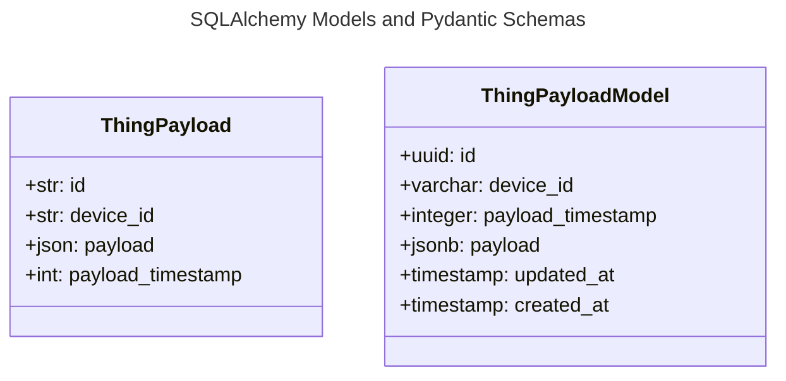

```mermaid
---
title: SQLAlchemy Models and Pydantic Schemas
---
classDiagram
    class ThingPayload {
        +str: id
        +str: device_id
        +json: payload
        +int: payload_timestamp
    }


    class ThingPayloadModel {
        +uuid: id
        +varchar: device_id
        +integer: payload_timestamp
        +jsonb: payload
        +timestamp: updated_at
        +timestamp: created_at
    }
```
