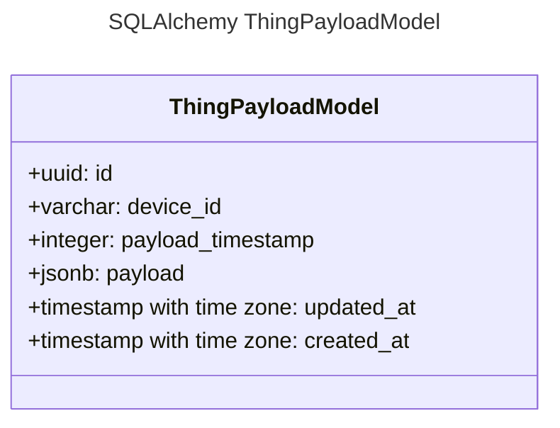

```mermaid
---
title: SQLAlchemy ThingPayloadModel
---
classDiagram
    class ThingPayloadModel {
        +uuid: id
        +varchar: device_id
        +integer: payload_timestamp
        +jsonb: payload
        +timestamp with time zone: updated_at
        +timestamp with time zone: created_at
    }
```
